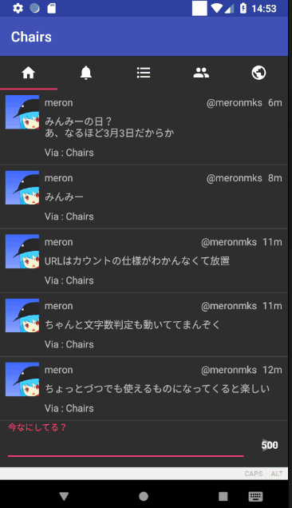

# Chairs
[](https://travis-ci.org/meronmks/Chairs)
[](https://codecov.io/gh/meronmks/Chairs)\
[](https://dply.me/g06yf0#install)

Android5.0以上で動作するMastodon専用クライアント。\
kotlin Ver1.2.40\

# 使用ライブラリ
[mastodon4j](https://github.com/sys1yagi/mastodon4j)\
[realm](https://realm.io/jp/)\
[glide](https://github.com/bumptech/glide)\
[Hyperion](https://github.com/willowtreeapps/Hyperion-Android)
[OkHttp](https://github.com/square/okhttp)
[Gson](https://github.com/google/gson)
[PhotoView](https://github.com/chrisbanes/PhotoView)
# 注意事項
本アプリケーションはベータ版配布及びログ解析に[deploygate](https://deploygate.com/)を使用しています。
また開発中のため急な仕様変更等が出て来る可能性が大きくあります。
# 完成目標
2018年6月20日（~~某サービスのUserStreamingの終了まで~~ 90日ほど伸びてしまったがせっかくなのでこのまま）
# ライセンス
ライブラリに関してはそのライブラリのものに準拠
このアプリのコードに関しては以下のライセンスを適応します

## Chairs
```
MIT License

Copyright (c) 2017 Toshihiro Yagi

Permission is hereby granted, free of charge, to any person obtaining a copy
of this software and associated documentation files (the "Software"), to deal
in the Software without restriction, including without limitation the rights
to use, copy, modify, merge, publish, distribute, sublicense, and/or sell
copies of the Software, and to permit persons to whom the Software is
furnished to do so, subject to the following conditions:

The above copyright notice and this permission notice shall be included in all
copies or substantial portions of the Software.

THE SOFTWARE IS PROVIDED "AS IS", WITHOUT WARRANTY OF ANY KIND, EXPRESS OR
IMPLIED, INCLUDING BUT NOT LIMITED TO THE WARRANTIES OF MERCHANTABILITY,
FITNESS FOR A PARTICULAR PURPOSE AND NONINFRINGEMENT. IN NO EVENT SHALL THE
AUTHORS OR COPYRIGHT HOLDERS BE LIABLE FOR ANY CLAIM, DAMAGES OR OTHER
LIABILITY, WHETHER IN AN ACTION OF CONTRACT, TORT OR OTHERWISE, ARISING FROM,
OUT OF OR IN CONNECTION WITH THE SOFTWARE OR THE USE OR OTHER DEALINGS IN THE
SOFTWARE.
```

## OkHttp
```
Licensed under the Apache License, Version 2.0 (the "License");
you may not use this file except in compliance with the License.
You may obtain a copy of the License at

   http://www.apache.org/licenses/LICENSE-2.0

Unless required by applicable law or agreed to in writing, software
distributed under the License is distributed on an "AS IS" BASIS,
WITHOUT WARRANTIES OR CONDITIONS OF ANY KIND, either express or implied.
See the License for the specific language governing permissions and
limitations under the License.
```

## Gson
```
Gson is released under the Apache 2.0 license.

Copyright 2008 Google Inc.

Licensed under the Apache License, Version 2.0 (the "License");
you may not use this file except in compliance with the License.
You may obtain a copy of the License at

    http://www.apache.org/licenses/LICENSE-2.0

Unless required by applicable law or agreed to in writing, software
distributed under the License is distributed on an "AS IS" BASIS,
WITHOUT WARRANTIES OR CONDITIONS OF ANY KIND, either express or implied.
See the License for the specific language governing permissions and
limitations under the License.
```